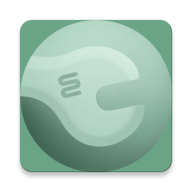

<p align="center">
  
</p>

<h1 align="center">Clank — Comunidad Creativa</h1>

<p align="center">
  Red social Android para compartir, descubrir e inspirarse con trabajos manuales
</p>

<p align="center">
  
  
  
  
  
  
  
  
</p>

---

## ¿Qué es Clank?

Clank es una aplicación móvil nativa Android orientada a la comunidad creativa. Permite a los usuarios publicar sus trabajos manuales paso a paso, descubrir proyectos de otros usuarios, guardar bocetos, explorar por categorías y conectar con perfiles afines.

El proyecto nació como respuesta a una carencia concreta en el ecosistema digital: la creatividad manual se encuentra dispersa entre redes sociales generalistas, plataformas de inspiración y espacios de compraventa, sin una solución especializada que acompañe el proceso creativo completo.

Clank es el Proyecto de Fin de Ciclo del Grado Superior de Desarrollo de Aplicaciones Multiplataforma (DAM) de Andrea Mangas Herrera y Loredana Francesca Giaramita Rivas, desarrollado durante el curso 2025–2026.

---

## Funcionalidades

### Autenticación
- Registro con correo y contraseña
- Inicio de sesión con Google (OAuth2)
- Selección de idioma antes del login (ES, EN, PT, FR, DE, IT)
- Completar perfil obligatorio tras el registro (nombre y Clank ID único)
- Cambio de contraseña mediante verificación por correo (Cloud Functions)
- Cierre de sesión y eliminación de cuenta

### Perfil
- Visualización del perfil propio con clanks publicados y borradores
- Edición de nombre, Clank ID y foto de perfil
- Visualización del perfil público de otros usuarios

### Clanks
- Creación con portada, título, descripción, materiales, herramientas, instrucciones paso a paso con imágenes opcionales, duración y categorías
- Guardado como boceto (no visible en el feed)
- Edición y eliminación de clanks propios
- Visualización del detalle completo de cualquier clank

### Feed y descubrimiento
- Feed global ordenado por fecha de publicación descendente (sincronización en tiempo real)
- Búsqueda por título, descripción o usuario
- Filtrado por categoría

### Interacción social
- Sistema de likes con contador en tiempo real
- Traducción dinámica de contenido en los 6 idiomas soportados (ML Kit on-device)

### Ajustes
- Cambio de idioma dinámico sin reinicio de la app
- Modo claro / modo oscuro
- Cambio de contraseña y gestión de cuenta

---

## Arquitectura

Clank está construida sobre una arquitectura **MVVM (Model-View-ViewModel) con Single Activity**, siguiendo los principios de separación de capas, código limpio y componentes reutilizables.

| Capa | Responsabilidad |
|---|---|
| **Vista** | Fragments + ViewBinding + LiveData. Solo observa y delega acciones al ViewModel |
| **ViewModel** | Lógica de negocio. Emite estados `CARGANDO`, `EXITO` y `ERROR` mediante `Recurso<T>` |
| **Repositorios** | `AuthRepository`, `ClankRepository`, `UsuarioRepository`, `ImagenRepository`, `LikeRepository`, `CategoriaRepository` |
| **DataSource** | `FirestoreDataSource` — abstracción CRUD genérica sobre el SDK de Firebase |

**Patrones y decisiones destacadas:**
- **Single Activity** con Navigation Component y `navgraph.xml` declarativo (15 destinos)
- **Hilt** para inyección de dependencias en toda la cadena ViewModel → Repository → DataSource
- **`Recurso<T>`** como wrapper de estados para comunicación ViewModel → Fragment
- **SharedViewModel** con scope de Activity para compartir datos entre fragmentos del mismo flujo
- **FirestoreRecyclerAdapter** (FirebaseUI) para sincronización reactiva del feed en tiempo real
- Gestión del back stack con `popUpTo` / `popUpToInclusive` en todos los flujos de autenticación
- **ViewBinding** en todos los fragments para acceso type-safe a las vistas

---

## Stack tecnológico

| Categoría | Tecnología | Versión |
|---|---|---|
| Lenguaje | Java | 11 |
| IDE | Android Studio | — |
| Build | Gradle / AGP | 8.13 / 8.13.2 |
| Base de datos | Cloud Firestore | BOM 33.12.0 |
| Autenticación | Firebase Auth | BOM 33.12.0 |
| Almacenamiento | Firebase Storage | BOM 33.12.0 |
| Funciones servidor | Cloud Functions | BOM 33.12.0 |
| Notificaciones | Firebase Cloud Messaging | BOM 33.12.0 |
| DI | Dagger Hilt | 2.51 |
| Navegación | Navigation Component | 2.8.9 |
| Imágenes | Glide | 4.16.0 |
| UI Firebase | FirebaseUI for Firestore | 8.0.2 |
| Diseño | Material Components | 1.12.0 |
| Layouts | ConstraintLayout / FlexboxLayout | 2.2.1 / 3.0.0 |
| Traducción | ML Kit Translate + Language ID | 17.0.3 / 17.0.6 |
| Avatares | CircleImageView | 3.1.0 |
| Lifecycle | ViewModel + LiveData | 2.8.3 |
| Google Auth | Play Services Auth | 21.5.1 |
| Tests unitarios | JUnit + Mockito | 4.13.2 / 5.11.0 |
| Tests UI | Espresso | 3.6.1 |
| Reporting tests | Allure | — |

---

 ## Estructura del proyecto

**`data/`**
- `model/` — Clank, Usuario, Material, Instruccion, Herramienta, Categoria
- `repository/` — AuthRepository, ClankRepository, UsuarioRepository, ImagenRepository, LikeRepository, CategoriaRepository
- `source/` — FirestoreDataSource (abstracción CRUD genérica sobre Firebase)

**`di/`**
- AppModule, FirebaseModule, EntryPoints (Hilt)

**`adapters/`**
- FeedAdapter, ClanksAdapter, BusquedaAdapter (FirestoreRecyclerAdapter)

**`ui/`**
- `auth/` — Registro, InicioSesion, CompletarPerfil
- `feed/` — FeedFragment + FeedViewModel
- `crear/` — CrearFragment + CrearViewModel
- `editar/` — EditarClankFragment + EditarClankViewModel
- `detalle/` — DetalleClankFragment + DetalleClankViewModel
- `perfil/` — PerfilFragment + PerfilViewModel
- `editarPerfil/` — EditarPerfilFragment + EditarPerfilViewModel
- `busqueda/` — BusquedaFragment + BusquedaViewModel
- `ajustes/` — AjustesFragment
- `idioma/` — ElegirIdiomaFragment + ElegirIdiomaViewModel
- `bienvenida/` — BienvenidaFragment + BienvenidaViewModel
- `inspirar/` — InspirarFragment + InspirarViewModel
- `logo/` — LogoFragment (splash)
- `comun/` — NavbarHost, HojaOpciones, AdaptadorOpciones

**`util/`**
- GestorIdioma, GestorTema, Recurso\<T\>, FechaUtils, AnimUtils

---

## Base de datos (Cloud Firestore)

**Colección `usuarios`**

| Campo | Tipo | Descripción |
|---|---|---|
| `uid` | String (PK) | Identificador de Firebase Auth |
| `correo` | String | Email de la cuenta |
| `nombre` | String | Nombre visible |
| `telefono` | Number | Opcional |
| `fotoPerfil` | String | URL en Firebase Storage |
| `usuarioClank` | String | Identificador único en la app |
| `fechaCreacion` | Date | Fecha de registro |
| `fechaNacimiento` | Date | Opcional |
| `enLinea` | Boolean | Estado de conexión |
| `ultimaConexion` | Number | Timestamp última conexión |

**Colección `clanks`**

| Campo | Tipo | Descripción |
|---|---|---|
| `clankId` | String (PK) | Identificador del clank |
| `usuarioId` | String (FK) | Referencia a `usuarios/{uid}` |
| `titulo` | String | Título del clank |
| `descripcion` | String | Descripción |
| `portada` | String | URL en Firebase Storage |
| `tiempo` | Number | Duración estimada (1 cohete · 2 liebre · 3 tortuga) |
| `estadoAcabado` | Boolean | `true` = publicado · `false` = borrador |
| `fechaCreacion` | Timestamp | ServerTimestamp |
| `fechaEdicion` | Timestamp | ServerTimestamp |
| `numLikes` | Number | Contador desnormalizado |

**Subcolecciones de cada clank:**

| Subcolección | Campos |
|---|---|
| `categorias` | `catId`, `categoria` |
| `herramientas` | `herrId`, `herramienta` |
| `materiales` | `matId`, `material`, `cantidad` |
| `instrucciones` | `instId`, `orden`, `instruccion`, `imagen` (opcional) |
| `likes` | `likeId`, `usuarioId` |
| `comentarios` | `comentId`, `usuarioId`, `comentario`, `timestamp` |

---

## Requisitos mínimos

| Parámetro | Valor |
|---|---|
| Android mínimo | 8.0 Oreo (API 26) |
| Android objetivo | Android 16 (API 36) |
| Almacenamiento mínimo | ~60 MB (instalación) |
| Almacenamiento en uso | ~240 MB (con caché de imágenes) |
| Conexión a internet | Requerida para todas las funciones principales |

---

## Configuración del proyecto

> ⚠️ Este repositorio no incluye el archivo `google-services.json` por seguridad. Para ejecutar el proyecto necesitas configurar tu propio proyecto en Firebase Console.

### Pasos

1. Clona el repositorio:
   ```bash
   git clone https://github.com/[org]/clank.git
2.	Crea un proyecto en Firebase Console y añade una app Android con el package  com.clank.app .
3.	Descarga el archivo  google-services.json  y colócalo en  app/ .
4.	Activa en Firebase Console:
	•	Authentication → Métodos: Email/contraseña y Google
	•	Cloud Firestore → Modo producción
	•	Firebase Storage
	•	Cloud Functions (requiere plan Blaze)
5.	Abre el proyecto en Android Studio y sincroniza Gradle.
6.	Ejecuta la app en un emulador o dispositivo físico con Android 8.0+.

---

## Convención de commits
Todos los commits del proyecto siguen el estándar definido por el equipo:

<ESTADO>:<TIPO>: Descripción en imperativo

ESTADO:
  WIP  — trabajo en progreso
  END  — código finalizado y listo para revisión

TIPO:
  #NNN — número de tarea en Nifty
  BUG  — corrección de error
  DOC  — documentación
  REF  — refactorización
  IMG  — cambios estéticos o de imagen
  TST  — código de testing

Ejemplos:
  END:#42: Feed de clanks con FirestoreRecyclerAdapter
  WIP:BUG: Fix en carga de imagen de portada con Glide
  END:DOC: Actualizado README con estructura del proyecto
  WIP:TST: Tests instrumentados del flujo de login

---

## Metodología de desarrollo
El proyecto se planificó y ejecutó siguiendo una metodología ágil híbrida (Scrum + Kanban) a lo largo de 4 sprints, con backlog priorizado, retrospectivas formales y trazabilidad completa entre tareas (Nifty), commits (Git) y Pull Requests (GitHub).
La gestión del alcance fue una decisión activa: tras la retrospectiva del Sprint 1, se redujo el scope del MVP para mantener los estándares de calidad técnica, priorizando una base sólida y escalable frente a un mayor número de funcionalidades.

